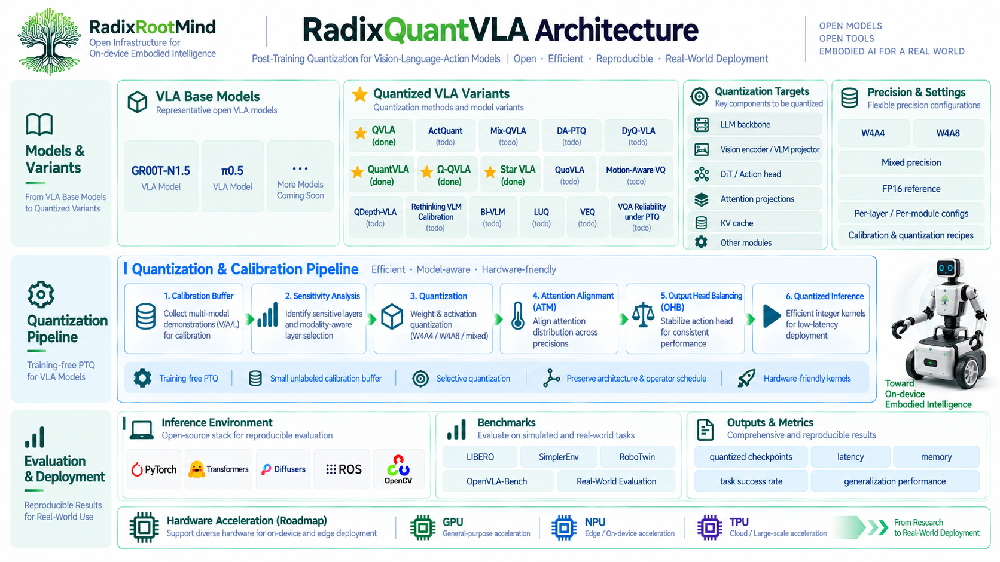
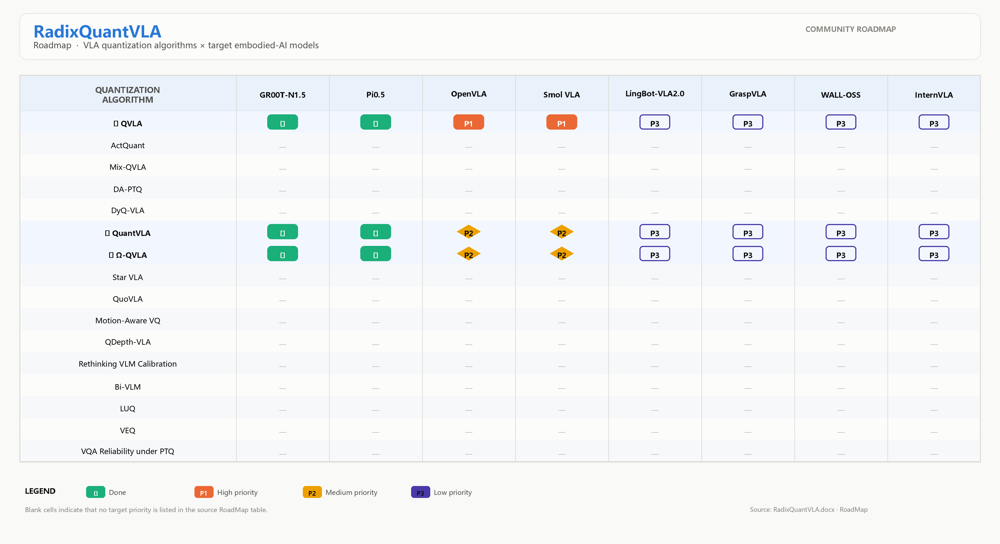

<p align="center">
  
</p>

# RadixQuantVLA: A Lego-like Framework for Unified Quantization and Deployment of Vision-Language-Action Models

<p align="center">
  
  
  
  
  
  
</p>

RadixQuantVLA is a unified research and engineering stack for post-training quantization, LIBERO evaluation, and deployment-oriented preparation of Vision-Language-Action (VLA) models.

The project integrates QuantVLA, Omega-QVLA, QVLA/OpenVLA, OpenVLA-OFT, OpenDriveLab/UniVLA, StarVLA, GR00T-N1.5, and Pi0.5/OpenPI-style routes behind a shared set of launchers, checkpoint conventions, output formats, and validation notes.

<p align="center">
  <a href="#why-radixquantvla">Why</a> | 
  <a href="#architecture">Architecture</a> | 
  <a href="#key-features">Key Features</a> | 
  <a href="#validation-snapshot">Validation</a> | 
  <a href="#quick-start">Quick Start</a> | 
  <a href="#supported-routes">Supported Routes</a> | 
  <a href="#roadmap">Roadmap</a>
</p>

> RadixQuantVLA is under active development. Large checkpoints, quantized packs, datasets, and generated benchmark outputs are intentionally kept outside git.

## Why RadixQuantVLA?

VLA models are not ordinary LLMs or VLMs. A VLA policy couples visual perception, language-conditioned reasoning, robot state, and action generation. Its output is not a text token but an executable robot action. A small low-bit error may propagate through perception, semantic grounding, action decoding, trajectory generation, contact dynamics, and closed-loop control.

This makes VLA quantization a behavior-preserving compression problem. Model size, token accuracy, or reconstruction error alone cannot tell whether a quantized policy still works. Practical VLA quantization must also preserve action fidelity, temporal stability, semantic-action alignment, and downstream task success.

Existing VLA quantization projects are fragmented across model families, runtime assumptions, checkpoint layouts, calibration procedures, and evaluation scripts. RadixQuantVLA turns these separate code paths into Lego-like, named routes so different models and quantization methods can be inspected, compared, reproduced, and extended in one project.

## What Breaks Without a Unified Stack?

| Fragmentation Point | Practical Impact |
| --- | --- |
| Separate launchers for each upstream project | Users repeatedly patch scripts, paths, ports, task ids, and runtime flags. |
| Conflicting dependency stacks | GR00T/Pi0.5, OpenVLA, UniVLA, and StarVLA may require different Python, PyTorch, and Transformers versions. |
| Inconsistent checkpoint and pack layouts | A run that works on one machine is difficult to reproduce on another. |
| Ambiguous quantization artifacts | Runtime quantization, `quantized.pt` packs, QVLA proxy files, gates, calibration files, and activation statistics are easy to confuse. |
| Scattered benchmark settings | LIBERO suite, task id, trial count, init offset, video, and logging choices become hidden variables. |
| No stable deployment boundary | Porting to DCU, NPU, IPU, or other accelerators requires clear definitions for model, operator, artifact, and runtime. |

RadixQuantVLA standardizes route names, launcher behavior, checkpoint conventions, logs, summaries, and route-level documentation.

## Architecture

RadixQuantVLA follows a modular, pipeline-oriented view of VLA quantization and deployment preparation.

<p align="center">
  
</p>

From this view, each route is a composable block: model loader, quantization method, calibration context, benchmark suite, output artifact, and validation record. This is the reason for the Lego-like design.

### Research Note: Calibration Granularity

Recent World Action Model quantization work, including QuantWAMs, reinforces an important point for embodied models: post-training quantization decisions should match the calibration context. For closed-loop or iterative action models, useful calibration is shaped by model structure, rollout distribution, and task objective. In practical terms, RadixQuantVLA treats calibration data, sensitivity analysis, layer protection, and route-specific artifacts as first-class engineering objects rather than hidden temporary files.

QuantWAMs is not advertised here as an integrated route. It is used as a research reference for future WAM-oriented extensions, especially around closed-loop rollout-aware calibration and video-action objective-aware precision allocation.

## Latest News

| Date | Update |
| --- | --- |
| 2026-09 | Project renamed and repositioned as `RadixQuantVLA`. README rebuilt around a unified VLA quantization and deployment architecture. |
| 2026-08 | StarVLA-OFT FP16/BF16 LIBERO route integrated and validated. |
| 2026-08 | UniVLA FP16 LIBERO route integrated and validated with action decoder support. |
| 2026-08 | QVLA/OpenVLA and OpenVLA-OFT mixed-bit W8 routes integrated. |
| 2026-08 | GR00T-N1.5 and Pi0.5/OpenPI W4A8/W4A4 routes validated under the unified launcher. |

## Key Features

| Layer | Purpose |
| --- | --- |
| Unified route launcher | One command surface for GR00T, Pi0.5/OpenPI, OpenVLA, OpenVLA-OFT, UniVLA, and StarVLA routes. |
| Quantization route integration | W4A8, W4A4, GPTQ, RTN, DuQuant, ATM/OHB, QVLA mixed-bit W8, and related calibration paths. |
| LIBERO evaluation | Consistent task-suite evaluation, rollout handling, logs, and merged summaries. |
| Artifact normalization | Standard locations for logs, summaries, rollouts, activation statistics, packs, proxy files, gates, and calibration files. |
| Reproducibility notes | Environment, checkpoint, known-fix, and validation documentation for each major route. |
| Hardware-portability preparation | Clear separation between model checkpoint, quantization route, runtime dependency, benchmark artifact, and deployment boundary. |

## Validation Snapshot

These are local engineering validation results after integration. They show that the listed routes run end-to-end in this repository. They are not claimed as official paper benchmark numbers.

<p align="center">
  
</p>

| Profile | Model | Suite | Route | Result |
| --- | --- | --- | --- | ---: |
| `groot_w4a8` | GR00T-N1.5 | LIBERO Object | Runtime DuQuant/ATM/OHB | 82.0% |
| `pi05_w4a8_duquant` | Pi0.5/OpenPI | LIBERO Object | Runtime DuQuant/ATM/OHB | 99.0% |
| `pi05_w4a4_gptq` | Pi0.5/OpenPI | LIBERO Object | W4A4 GPTQ/SVD-Hadamard pack | 98.0% |
| `openvla_fp16` | OpenVLA | LIBERO Spatial | FP16 baseline | 70.0% |
| `openvla_qvla_w8` | OpenVLA | LIBERO Spatial | QVLA mixed-bit W8 | 80.0% |
| `openvla_oft_fp16` | OpenVLA-OFT | LIBERO Spatial | FP16 baseline | 60.0% |
| `openvla_oft_qvla_w8` | OpenVLA-OFT | LIBERO Spatial | QVLA mixed-bit W8 | 26.0% |
| `univla_fp16` | UniVLA | LIBERO Spatial | FP16 with action decoder | 96.0% |
| `starvla_oft_fp16` | StarVLA-OFT | LIBERO Spatial | FP16/BF16 policy-server evaluation | 99.0% |

## Verified Environment

The validation snapshot above was reproduced on the following workstation:

| Component | Configuration |
| --- | --- |
| GPU | NVIDIA A100 40GB |
| CPU | Intel(R) Xeon(R) Gold 6248R CPU @ 3.00GHz |
| System memory | 96 GB |
| Storage | 200 GB SSD |

## Supported Routes

| Model family | Profiles | Quantization / evaluation status |
| --- | --- | --- |
| GR00T-N1.5 | `groot_fp16`, `groot_w4a8`, `groot_w4a4_gptq`, `groot_w4a4_duquant`, `groot_w4a4_rtn` | FP16, runtime W4A8, W4A4 GPTQ pack, W4A4 DuQuant, and W4A4 RTN routes. |
| Pi0.5/OpenPI | `pi05_fp16`, `pi05_w4a8_duquant`, `pi05_w4a4_gptq`, `pi05_w4a4_rtn` | OpenPI service evaluation with FP16, runtime W4A8, W4A4 GPTQ pack, and W4A4 RTN routes. |
| OpenVLA | `openvla_fp16`, `openvla_qvla_w8` | FP16 baseline and QVLA mixed-bit W8 evaluation. |
| OpenVLA-OFT | `openvla_oft_fp16`, `openvla_oft_qvla_w8` | FP16 baseline and QVLA mixed-bit W8 evaluation. |
| UniVLA | `univla_fp16` | FP16 evaluation with an external action decoder. Quantized UniVLA routes are not advertised as validated yet. |
| StarVLA | `starvla_oft_fp16`, `starvla_gr00t_fp16`, `starvla_pi_fp16`, `starvla_fast_fp16` | StarVLA-OFT FP16/BF16 is validated. Other FP16/BF16 entries require matching checkpoints. Quantized StarVLA routes require future Qwen-VL/action-head adapters. |
| WAM extensions | Planned | QuantWAMs-style closed-loop calibration and video-action objective-aware precision allocation are future research directions. |

## Quick Start

Detailed installation, checkpoint preparation, and route-specific verification commands are maintained in `docs/`.

```bash
git clone https://github.com/RadixRootMind/RadixQuantVLA.git RadixQuantVLA
cd RadixQuantVLA

cp .env.example .env.local
source .env.local

bash scripts/run_awesome_quant_vla.sh groot_w4a8 \
  --suite object \
  --gpus 0 \
  --trials 1 \
  --action plan
```

Recommended documentation order:

- [Installation](docs/installation.md)
- [Checkpoints and Quantized Packs](docs/checkpoints.md)
- [Usage](docs/usage.md)
- [Verification Guide](docs/verification.md)
- [OpenVLA/QVLA Guide](docs/qvla_openvla.md)
- [UniVLA Guide](docs/univla.md)
- [StarVLA Guide](docs/starvla.md)
- [Chinese Documentation](docs/zh_cn/README.md)

## Checkpoints and Artifacts

Checkpoints and quantized packs are not committed. By convention, local assets are staged under `$CHECKPOINTS_ROOT`, while generated outputs and downloaded quantized packs are staged under `results/`.

Important route differences:

- Runtime W4A8 routes, such as `groot_w4a8` and `pi05_w4a8_duquant`, do not require a prebuilt `quantized.pt` pack.
- W4A4 GPTQ routes, such as `groot_w4a4_gptq` and `pi05_w4a4_gptq`, require an existing or locally built `quantized.pt` pack.
- QVLA W8 routes generate calibration JSONL, Hessian proxy, gate/bit-allocation artifacts, and evaluation outputs. `proxy.pt` is an analysis artifact, not a standalone deployable quantized model.
- Pi0.5 routes require an OpenPI PyTorch checkpoint converted from the official OpenPI JAX/Orbax checkpoint.
- UniVLA and StarVLA routes require their own model checkpoints and, where applicable, action decoder assets.

See [docs/checkpoints.md](docs/checkpoints.md) for concrete download and conversion commands.

## Output Semantics

A successful evaluation usually writes:

```text
results/<run_name>/
|-- merged_summary.json
|-- merged_summary.md
|-- logs/
|-- summaries/
|-- rollouts/
|-- act_stats/
|-- packdir/
`-- proxy/ or gates/ or calib/ when required by the route
```

The primary benchmark evidence is `merged_summary.json` and `merged_summary.md`. Intermediate folders such as `act_stats/`, `packdir/`, `proxy/`, `gates/`, and `calib/` are route-specific artifacts and should not be mistaken for a final deployable model.

## Repository Layout

```text
RadixQuantVLA
|-- .env.example
|-- docs/
|-- scripts/
|-- tools/
|-- gr00t/
|-- examples/Libero/
|-- atm_alpha_beta_pi05/
|-- third_party/
|   |-- openvla
|   |-- openvla_oft
|   |-- univla
|   `-- starvla
|-- tests/
`-- results/
```

## Scope and Non-goals

RadixQuantVLA focuses on research reproduction, post-training quantization evaluation, and engineering integration for VLA models.

It does not bundle large checkpoints or datasets. It also does not claim that every route emits a standalone deployable quantized model for real robots or non-NVIDIA accelerators. Some routes evaluate quantized behavior at runtime, some load prebuilt GPTQ packs, and some produce calibration, proxy, or bit-allocation artifacts.

Real robot deployment still requires model export, runtime conversion, hardware operator support, latency validation, and integration with the robot control stack.

## Community

Join the RadixRootMind China developer WeChat group:

<p align="center">
  
</p>

## Roadmap

<p align="center">
  
</p>

This table lists VLA quantization algorithms and target embodied AI models for community developers.

- P1 (High Priority): Critical tasks. Prioritized for implementation, validation and offline robot real-machine demo.
- P2 (Medium Priority): Follow-up optimization tasks, to be tackled after completing all P1 items.
- P3 (Low Priority): Long-term research, benchmark and exploratory work.

- Normalize route-level benchmark manifests and scorecards.
- Add stronger smoke tests for all public profiles.
- Improve offline checkpoint and quantized-pack discovery.
- Extend hardware-portability notes for DCU, NPU, IPU, and other accelerator platforms.
- Explore WAM-oriented quantization routes inspired by closed-loop calibration and video-action objective-aware precision allocation.
- Promote additional UniVLA and StarVLA quantized routes after validation.

We welcome developers to join and participate in the development of RadixQuantVLA.

## Lineage and Credits

RadixQuantVLA integrates and adapts ideas and code paths from QuantVLA, Omega-QVLA, QVLA/OpenVLA, OpenVLA-OFT, OpenDriveLab/UniVLA, StarVLA, OpenPI, GR00T, and LIBERO. It also tracks related research directions such as QuantWAMs for future WAM-oriented quantization extensions. Please check the original repositories, papers, and licenses when using or redistributing derived components.
